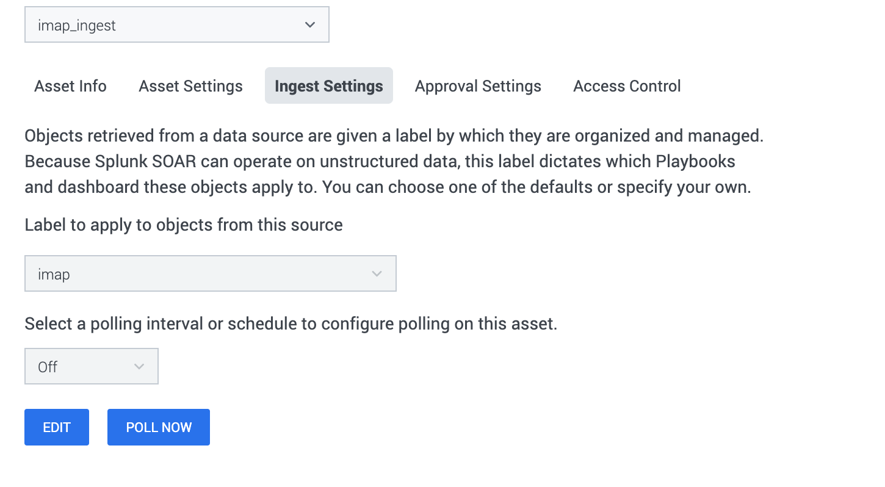
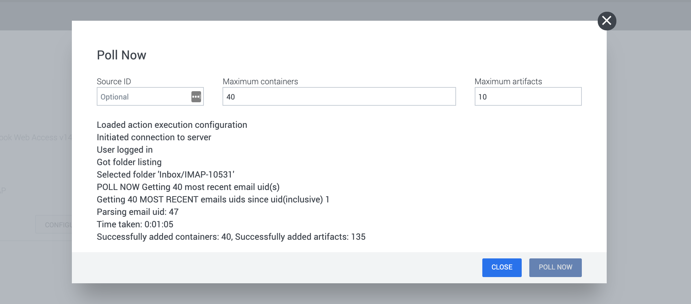
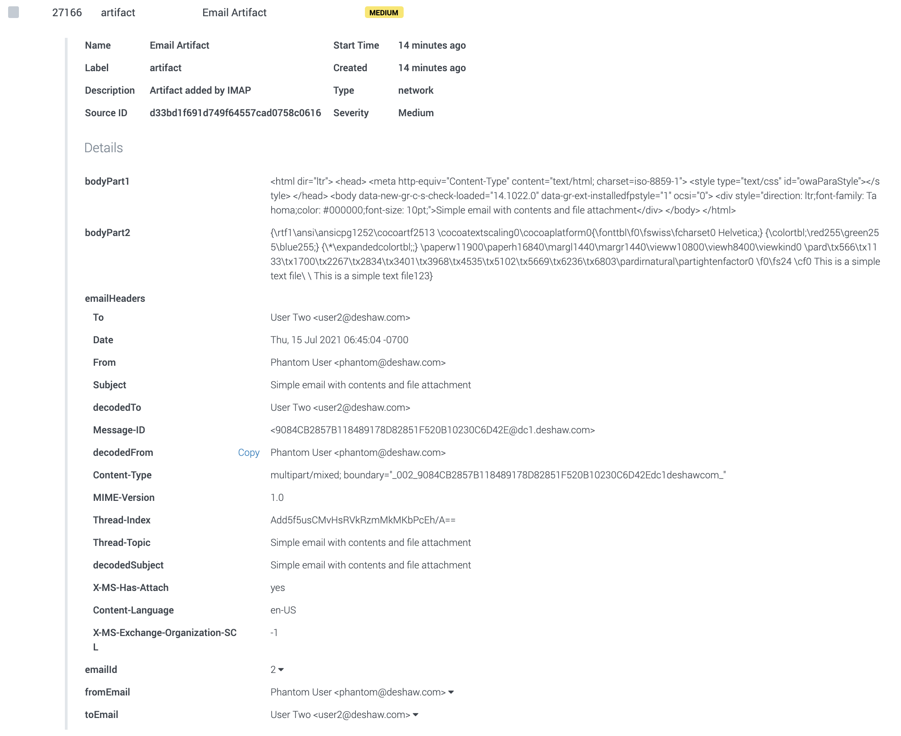
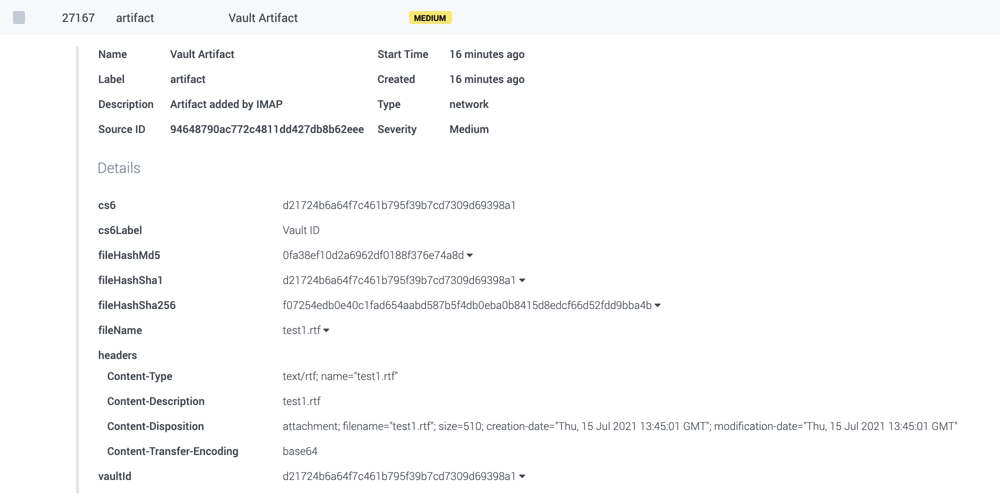

[comment]: # " File: readme.md"
[comment]: # "  Copyright (c) 2014-2021 Splunk Inc."
[comment]: # ""
[comment]: # "Licensed under the Apache License, Version 2.0 (the 'License');"
[comment]: # "you may not use this file except in compliance with the License."
[comment]: # "You may obtain a copy of the License at"
[comment]: # ""
[comment]: # "    http://www.apache.org/licenses/LICENSE-2.0"
[comment]: # ""
[comment]: # "Unless required by applicable law or agreed to in writing, software distributed under"
[comment]: # "the License is distributed on an 'AS IS' BASIS, WITHOUT WARRANTIES OR CONDITIONS OF ANY KIND,"
[comment]: # "either express or implied. See the License for the specific language governing permissions"
[comment]: # "and limitations under the License."
[comment]: # ""
# IMAP

It is not uncommon for enterprises to have a single mailbox configured where users can forward
suspicious emails for further investigation. The ingestion feature in the IMAP app is primarily
designed to pull emails from such a mailbox and create containers and artifacts in Phantom.

To add an IMAP Asset in Phantom, from the **Main Menu** , select **Apps** . In the **Search Apps**
field, search for the **IMAP** App by typing "IMAP" into the search field and hitting enter. To the
right of the App name, click on the **Configure New Asset** button.

  
  

In the **Asset Info** tab, the **Asset Name** and **Asset Description** can be whatever you want,
we've chosen "imap_ingest" for this example. The **Product Vendor** and **Product Name** fields will
be populated by Phantom and are not user-configurable. Do not click **Save** yet, navigate to the
next tab, **Asset Settings** .

  
  

The **Asset Settings** tab provides the configuration information Phantom uses to communicate with
the mail server. Fill in the **Server IP/Hostname** , **Username** , and **Password** . The
remaining configuration fields can be adjusted to suit the email environment. Do not click **Save**
yet, navigate to the next tab, **Ingest Settings** .

**NOTE:**

-   One of the configuration fields "Folder to ingest mails from (default is inbox)" can contain
    letters, digits, blank spaces as well as special characters in its value. Few values like Latin,
    Polish, etc characters and emojis are not considered valid for this field.
-   For the IMAP app, we won't be able to route traffic through the proxy. So if the user tries to
    add any proxy in variables of the asset, it won't affect the app's connectivity.

  
  

The **Ingest Settings** tab sets the container type the ingested IMAP data will be placed. Select
the appropriate label name or create a new label. In this example, the label name **imap** has been
selected. Choose "Off" for Manual polling from the dropdown of **Select a polling interval or
schedule to configure polling on this asset** or select "Scheduled" or "Interval". Set the **Polling
Interval** to the desired number of minutes. NOW you can click **Save** . The settings in the
**Approval Settings** tab are not used for the communication between Phantom and IMAP and can be
configured later. You will see the saved Asset. Return to the **Ingest Settings** tab if you are not
already there. Notice that you now have a **Poll Now** button, as shown here:

  
  

Click **Poll Now** . There are a few options you can set, In this example the **Maximum containers**
to 40 and **Maximum artifacts** to 10, the default values are also fine. Click the **Poll Now**
button at the bottom of the dialog. You will see some text begin to scroll by inside the text field,
indicating progress. Parsing data might take a while. The dialog should look like this.

  
  

Now that the config is out of the way, let's delve into the two modes that ingestion can occur and
the differences between them. One thing to note is that for every email that is ingested, a single
container is created containing multiple artifacts.

## POLL NOW

POLL NOW should be used to get a sense of the containers and artifacts that are created by the app.
The POLL NOW window allows the user to set the "Maximum containers" that should be ingested at this
instance. Since a single container is created for each email, this value equates to the maximum
emails that are ingested by the App. The App will either get the oldest email first or the latest,
depending upon the configuration parameter *How to ingest* .

## Scheduled Polling

This mode is used to schedule a polling action on the asset at regular intervals, which is
configured via the Ingest tab of the asset. It makes use of the following asset configuration
parameters (among others):

-   Maximum emails to poll the first time

      
    The App detects the first time it is polling an asset and will ingest these number of emails (at
    the most).

-   Maximum emails to poll

      
    For all scheduled polls after the first, the app will ingest these numbers of emails.

-   How to ingest

      
    Should the app be ingesting the latest emails or the oldest?

In the case of Scheduled Polling, on every poll, the App remembers the last email that it has
ingested and will pick up from the next one in the next scheduled poll.

### How to ingest

The app allows the user to configure how it should ingest emails on every scheduled poll, *oldest
first* , or *latest first* . Depending upon the scheduled interval and how busy the inbox is one of
the following could potentially happen

-   oldest first

      
    If the app is configured to poll too slowly and the inbox is so busy that on every poll the
    maximum ingested emails is less than the number of new emails, the app will never catch up.

-   latest first

      
    If the app is configured to poll too slowly and the inbox is so busy that on every poll the
    maximum ingested emails is less than the number of new emails, the app will drop the older
    emails since it is ingesting the latest emails that came into the mailbox.

For best results, keep the poll interval and *Maximum emails to poll* values close to the number of
emails you would get within a time interval. This way, every poll will end up ingesting all the new
emails.

## Containers created

As mentioned before, the app will create a single container for each email that it ingests with the
following properties:

-   Name

      
    The email subject is used as the name of the container. If a subject is not present the
    generated name is of the format: "Email UID: the_numeric_email_id"

-   Source ID

      
    The source ID of the container will be set to the "{hash_value_of_foldername} : {email_id}".

The data section of the container will contain the complete raw email in a key named 'raw_email'.
The UI allows the user to download this raw data JSON into a file. This same data can be extracted
in a playbook also for further processing.

## Playbook Backward Compatibility

-   The existing container's source_data_identifier has been modified. Hence, it is requested to the
    end-user to please update their existing playbooks by re-inserting \| modifying \| deleting the
    corresponding action blocks or by providing appropriate values to the action parameters in case
    source_data_identifier is used, to ensure the correct functioning of the playbooks created on
    the earlier versions of the app.
-   The format of container source_data_identifier has been changed from "{email_id}" to
    "{hash_value_of_foldername} : {email_id}" which helps to create containers correctly while
    fetching data from the IMAP server.

## Artifacts created

The App will create the following type of artifacts:

-   Email Artifact

      
    The email addresses that are found in the ingested email will be added as a separate artifact.
    Any attached email will also be scanned and the address present in the attached email will be
    added as a separate artifact. The emails are added as custom strings in the CEF structure in the
    following manner.

    | **Artifact Field** | **Value Details**                                                                  |
    |--------------------|------------------------------------------------------------------------------------|
    | Source ID          | Email ID set on the server                                                         |
    | cef.fromEmail      | From email address                                                                 |
    | cef.toEmail        | To email address                                                                   |
    | cef.emailHeaders   | A dictionary containing each email header as a key and it's value as the key-value |

    

-   IP Artifact
    -   If **extract_ips** is enabled, any IPv4 or IPv6 found in the email body will be added, with
        one CEF per IP.
    -   Any IP addresses found in the email are added to the CEF structure of an artifact.
    -   The CEF for an IP is cef.sourceAddress.

-   Hash Artifact - cef.fileHash

      

    -   If **extract_hashes** is enabled, any hash found in the email body will be added, with one
        CEF per hash.
    -   Any Hashes found in the email are added to the CEF structure of an artifact.
    -   The CEF for a hash is cef.fileHash.

-   URL Artifact - cef.requestURL

      

    -   If **extract_urls** is enabled, any URL found in the email body will be added, with one CEF
        per URL.
    -   Any URLs found are added to the CEF structure of an artifact.
    -   The CEF for a URL is cef.requestURL.

-   Domain Artifact - cef.destinationDnsDomain

      

    -   If **extract_domains** is enabled, any domain found in the email body will be added, with
        one CEF per domain.
    -   Domains that are part of a URL or an email address are added to the CEF structure of an
        artifact.
    -   The CEF for a URL is cef.destinationDnsDomain.

-   Vault Artifact

    -   If the email contains any attachments, these are extracted (if enabled in the config) and
        added to the vault of the Container.
    -   At the same time, the vault id and file name of this item is represented by a Vault
        Artifact.
    -   The same file can be added to the vault multiple times. In this scenario, the file name of
        the item added the second time onwards will be slightly different, but the vault id will
        still be the same. However, there will be multiple artifacts created.
    -   Do note that the system does *not* duplicate the file bytes, only the metadata in the db.
        | **Artifact Field** | **Value Details**                   |
        |--------------------|-------------------------------------|
        | Source ID          | Email ID set on the server          |
        | cef.vaultID        | Vault ID of the attachment          |
        | cef.fileName       | Attached filename used in the email |
    -   You will notice additional CEF fields **cs6** (value is the Vault ID) and **cs6Label** .
        These are added for backward compatibility only and will be deprecated in future releases.
        Please don't use these keys in playbooks.

      
    \*\* Since the vault id cannot be represented by a native CEF field, it is placed in the **cs6**
    CEF key and the cs6Label key is set to "vault_id".
    
